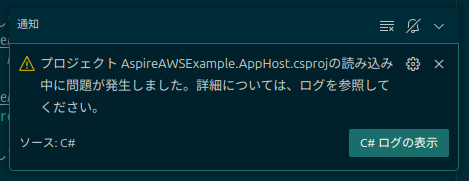

# aws_dotnet_aspire_example1

## 概要
* AWS のサーバーレスウェブアプリケーションを .NET Aspire for AWS で構築する。

.NET .NET Aspire の概要  
https://learn.microsoft.com/ja-jp/dotnet/aspire/get-started/aspire-overview  
> .NET Aspire は、監視可能な運用対応アプリを構築するためのツール、テンプレート、パッケージのセットです。

.NET Aspire って何？ - 概要  
https://qiita.com/takashiuesaka/items/f45e930ef296c5710acc  
> 一言で言えば分散アプリケーションの開発を便利にするためのツールとして開発されました。でも、中身を知ると決して分散アプリケーションにしか使用できないものではない、ということがわかってきます。全ての.NET開発者にとって関係があるものと言えるでしょう。

  
  
  

AWS での .NET  
AWS で .NET アプリケーションを構築、デプロイおよび開発する  
https://aws.amazon.com/jp/developer/language/net/  

Integrations with .NET Aspire for AWS  
https://github.com/aws/integrations-on-dotnet-aspire-for-aws  

> このリポジトリには、.NET Aspire 向けの AWS 統合が含まれています。  
これらの AWS 統合は、開発環境における AWS アプリケーションリソースのプロビジョニングおよび操作に焦点を当てています。  
アプリケーションコードと AWS リソースの繰り返し作業（開発のインナー・ループ）を、開発環境を離れることなくシームレスに行えるようにします。  
> 
> 以下は、現在 .NET Aspire に対応している AWS 統合の一覧です。  
> 
> ## Aspire.Hosting.AWS  
> Aspire アプリケーション向けに AWS リソースをプロビジョニングおよび構成するために、Aspire AppHost プロジェクトに含めるホスティング用パッケージです。  
このパッケージには、以下の機能が含まれています：  
> * .NET 向け AWS SDK における AWS 認証情報およびリージョンの構成
> * CloudFormation テンプレートを使用した AWS リソースのプロビジョニング
> * AWS Cloud Development Kit（CDK）を使用した AWS リソースのプロビジョニング
> * DynamoDB を使ったローカル開発
> * AWS Lambda および API Gateway を使ったローカル開発

## 留意事項
### 現在、以下の通知や出力などに警告が表示されますが、無視してください。  
  
```
2025-03-30 19:57:19.972 [info] [Warn  - 7:57:19 PM] [LanguageServerProjectSystem] Warning while loading /workspaces/aws_dotnet_aspire_example1/AspireAWSExample.AppHost/AspireAWSExample.AppHost.csproj: '../AspireAWSExample.ToUpperLambdaFunction/src/AspireAWSExample.ToUpperLambdaFunction/AspireAWSExample.ToUpperLambdaFunction.csproj' is referenced by an Aspire Host project, but it is not an executable. Did you mean to set IsAspireProjectResource="false"?
2025-03-30 19:57:19.972 [info] [Warn  - 7:57:19 PM] [LanguageServerProjectSystem] Warning while loading /workspaces/aws_dotnet_aspire_example1/AspireAWSExample.AppHost/AspireAWSExample.AppHost.csproj: '../AspireAWSExample.WebDefaultRouteLambdaFunction/src/AspireAWSExample.WebDefaultRouteLambdaFunction/AspireAWSExample.WebDefaultRouteLambdaFunction.csproj' is referenced by an Aspire Host project, but it is not an executable. Did you mean to set IsAspireProjectResource="false"?
```

※Aspire は参照先のプロジェクトが EXE でないと警告を表示します。  
Aspire.Hosting.AWS.Lambda の AddAWSLambdaFunction が実行時に EXE に置き換わる仕様のようで、Aspire がそのシナリオを想定していないのか、現在警告を抑止する方法がありません。今は無視するしかなさそうです。

### デバッグ実行時に Lambda 関数でブレークポイントが機能しません。
※ブログではデバッグできるっぽいこと言ってるから、やり方が何か悪いのかも？

## 詳細

Aspire.Hosting.AWS library  
https://github.com/aws/integrations-on-dotnet-aspire-for-aws/blob/main/src/Aspire.Hosting.AWS/README.md  

.NET Aspire Lambda Local Development Feature Tracker #17  
https://github.com/aws/integrations-on-dotnet-aspire-for-aws/issues/17  
> 現在、.NET Aspire における Lambda のローカル開発統合はプレビュー段階にあります。  
新しい `AddAWSLambdaFunction` および `AddAWSAPIGatewayEmulator` API には `RequiresPreviewFeatures` 属性が付与されており、これらを使用するにはプレビューフィーチャーの有効化が必要です。最も簡単な方法は、`AppHost` の `Program.cs` の先頭に以下の行を追加することです：
> ```csharp
> #pragma warning disable CA2252
> ```
> Lambda 統合は、現在プレビュー中の新しい .NET ツール「Amazon.Lambda.TestTool」に依存しています。  
`Aspire.Hosting.AWS` パッケージのバージョン 9.1.2 以降では、`AppHost` の起動時にこのツールが自動でインストール・更新されます。  
> 
> **更新情報（2025年3月4日）**  
AWS Lambda 統合は「Developer Preview（開発者向けプレビュー）」ステータスに到達しました。以下のブログ記事がこのプレビューに関して公開されています：
> 
> * [Building and Debugging .NET Lambda applications with .NET Aspire (Part 1)](https://aws.amazon.com/blogs/developer/building-lambda-with-aspire-part-1/)
> * [Building and Debugging .NET Lambda applications with .NET Aspire (Part 2)](https://aws.amazon.com/blogs/developer/building-lambda-with-aspire-part-2/)


Integrations with .NET Aspire for AWS - Playground ※ここのサンプルが一番新しそう
https://github.com/aws/integrations-on-dotnet-aspire-for-aws/tree/main/playground

### AppHost を作成する

```
dotnet new gitignore
dotnet new sln -n AspireAWSExample

dotnet new aspire-apphost  -n AspireAWSExample.AppHost
# ※↑デフォルトでは .NET 9 なのでプロジェクトファイルを .NET 8 に手動で書き換えること

dotnet sln add AspireAWSExample.AppHost
dotnet add AspireAWSExample.AppHost package Aspire.Hosting.AWS
```

### AspireAWSExample.AppHost がデフォルトでは .NET 9 なので 8 に変更する

AspireAWSExample.AppHost/AspireAWSExample.AppHost.csproj
```xml
    <TargetFramework>net9.0</TargetFramework>　←　net8.0 に書き換える
```

### 指定された文字を大文字に変換する(※) Lambda 関数プロジェクトを作成する  
※テンプレートのサンプルが最初からそうなってる
```
dotnet new lambda.EmptyFunction -n AspireAWSExample.ToUpperLambdaFunction
dotnet sln add AspireAWSExample.ToUpperLambdaFunction/src/AspireAWSExample.ToUpperLambdaFunction
dotnet sln add AspireAWSExample.ToUpperLambdaFunction/test/AspireAWSExample.ToUpperLambdaFunction.Tests
dotnet add AspireAWSExample.AppHost reference AspireAWSExample.ToUpperLambdaFunction/src/AspireAWSExample.ToUpperLambdaFunction
dotnet add AspireAWSExample.ToUpperLambdaFunction/src/AspireAWSExample.ToUpperLambdaFunction package Amazon.Lambda.APIGatewayEvents
dotnet add AspireAWSExample.ToUpperLambdaFunction/test/AspireAWSExample.ToUpperLambdaFunction.Tests package Amazon.Lambda.APIGatewayEvents
```
※ソースの変更はソース参照


### ウェブページを返す Lambda 関数プロジェクトを作成する

```
project_name=WebDefaultRouteLambdaFunction
dotnet new lambda.EmptyFunction -n AspireAWSExample.${project_name}
dotnet sln add AspireAWSExample.${project_name}/src/AspireAWSExample.${project_name}
dotnet sln add AspireAWSExample.${project_name}/test/AspireAWSExample.${project_name}.Tests
dotnet add AspireAWSExample.AppHost reference AspireAWSExample.${project_name}/src/AspireAWSExample.${project_name}
dotnet add AspireAWSExample.${project_name}/src/AspireAWSExample.${project_name} package Amazon.Lambda.APIGatewayEvents
dotnet add AspireAWSExample.${project_name}/test/AspireAWSExample.${project_name}.Tests package Amazon.Lambda.APIGatewayEvents
```
※ソースの変更はソース参照

## テスト
各 Lambda 関数の Tests プロジェクトで個別に実行するか以下を実行
```
dotnet test
``` 

## 実行
F5 か以下を実行
```
dotnet run --project AspireAWSExample.AppHost
```

## トラブルシューティング

なんかよくわからんエラー出たり、うまく動かない時は、とりあえずコマンドから「開発者: ウィンドウの再読み込み」を実行してみる。  　
※特に C# の拡張機能周りはプロジェクトの変更などうまく反映されないことが多いので、ウィンドウの最読み込みで拡張機能ごと再起させるとだいたい直る。　　